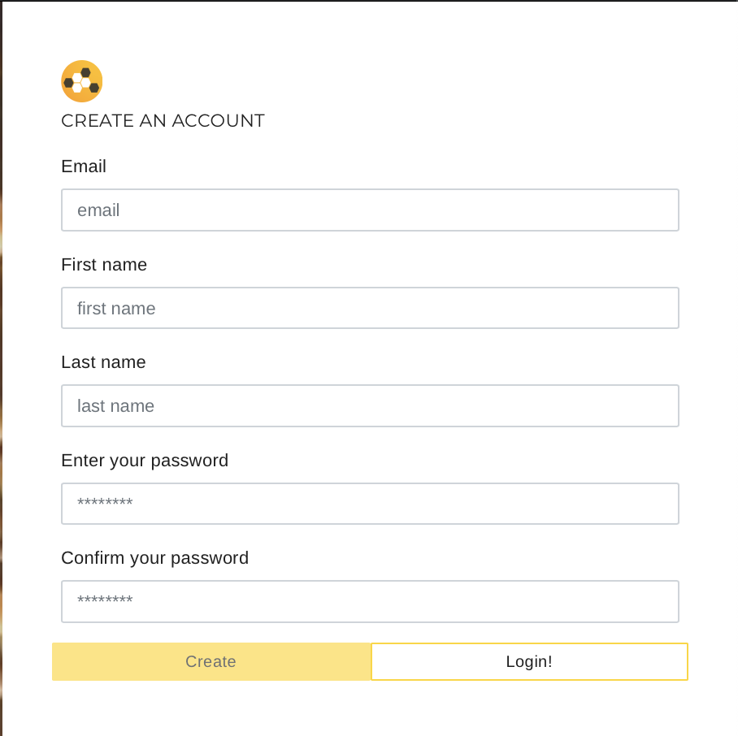
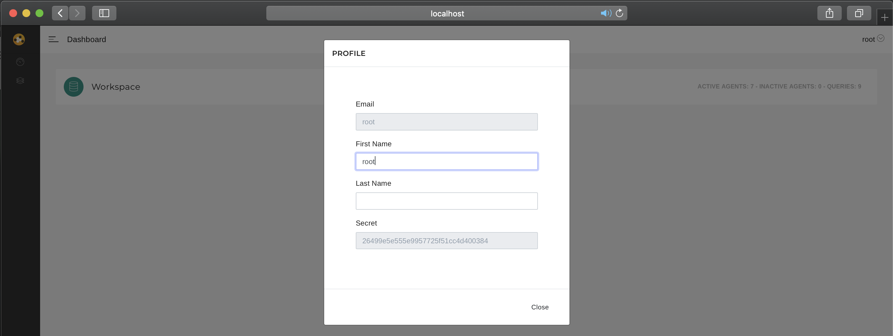
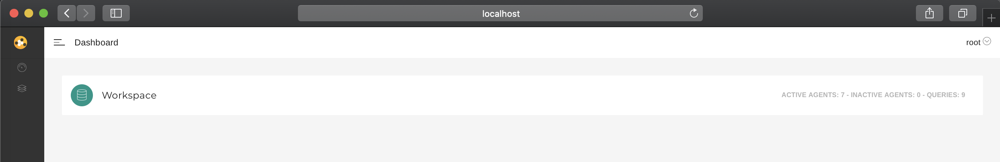
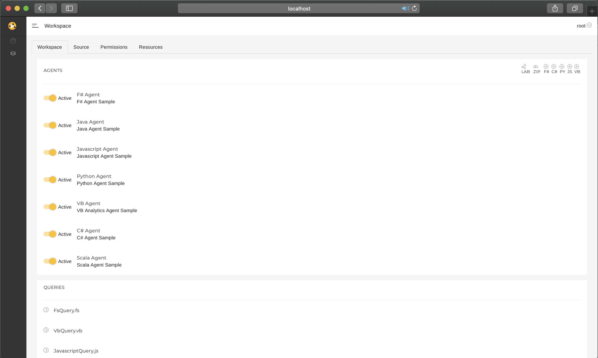
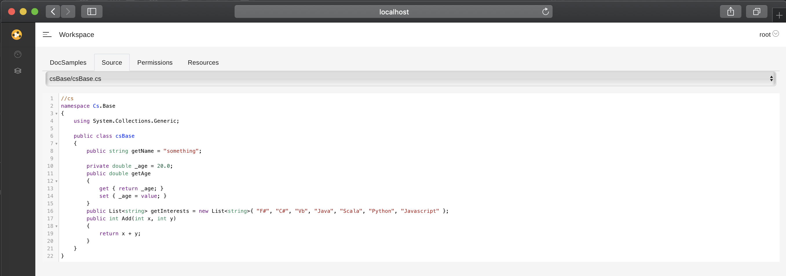
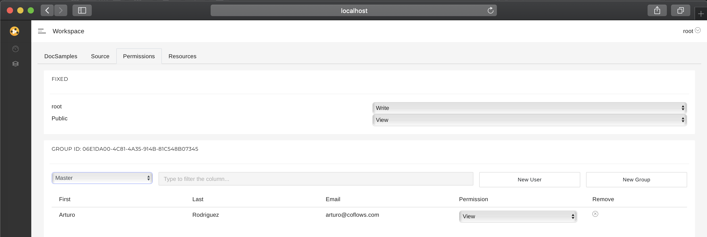
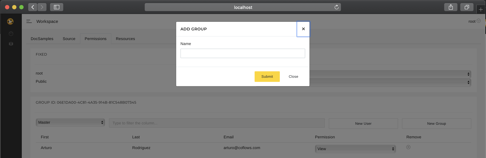
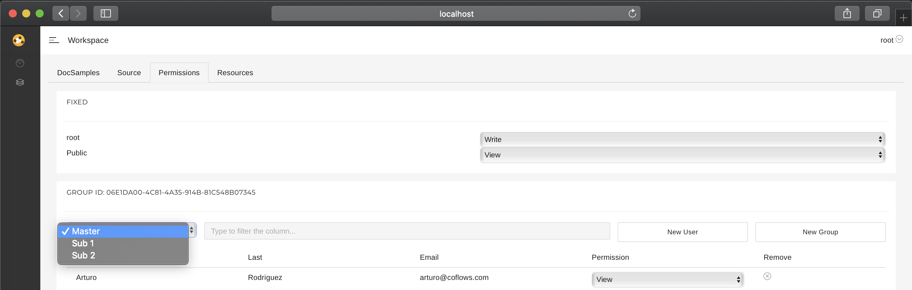

# CoFlows - Containerized Polyglot Runtime (Interop)

**CoFlows CE (Community Edition)** is a Containerized Polyglot Runtime that simplifies the development, hosting and deployment of powerful data-centric workflows. **CoFlows** enables developers to create rich **Web-APIs** with almost **zero boiler plate** and scheduled / reactive processes through a range of languages including CoreCLR (C#, F# and VB), JVM (Java and Scala), Python and Javascript. Furthermore, functions written in any of these languages can call each other within the same process with **full interop**.

As a Containerized Polyglot Runtime, its functionality allows developers to build complex workflows leveraging off great open-source libraries written in various languages. The wealth of distributed computing libraries of Java / Scala together with Python's data science tools are all available in order to use the right tool for the right purpose within the same process!

Furthermore, our aim with **CoFlows** is to offer simplicity for **Data Scientists** in order to quickly build self-contained projects while leveraging off popular tools. To this end, once a developer pulls the **CoFlows** image, a range of tools are at their disposal as first class citizens of the **CoFlows** ecosystem:
* DotNet Core 3.0
* Python 3.7.4
* Java 1.8
* Scala 2.11.8
* JupyterLab

Additionally, **CoFlows** offers great features including:
* Free and automatically generated SSL certificates through an integrated _LetsEncrypt_ functionality
* Integrated deployment to **Azure Container Instances**
* Integrated deployment from **GitHub** repositories
* Users and Permissions management
* Storage through either SQLite for local persistence or Microsoft SQL Server for cloud persistence. We will add more connectors in the near future.

... and yes, it is a big image taking 900Mb to download and 1.9Gb of space during runtime.

Our **Community Edition** is a version of our commercial codebase that we have used in various Data science projects including:
* Algorithmic Trading
* Vessel tracking and commodity trade flow projections
* Macro-economic risk management
* Global equity selection strategy simulations
* Healthcare cost and clinical segmentation analysis on national data

For more information visit https://www.coflows.com.

This edition will be tightly coupled with the **CoFlows Cloud** making it much easier for developers to deploy and host their applications. More information on this coming soon.

## Polygot
Let's start with a definition. According to Wikipedia, in computing, a polyglot is a computer program or script written in a valid form of multiple programming languages, which performs the same operations or output independent of the programming language used to compile or interpret it.

There are multiple sources pushing both the pros and cons of polyglot systems and this is not the place to discuss it. We believe that the ability to express algorithms in the correct language and using the best libraries for the right task is essential. **CoFlows** uses the **QuantApp.Engine** and **QuantApp.Kernel** libraries to offer interop between:
* CoreCLR: C#, F# & VB
* JVM: Java & Scala
* Python
* Javascript

### Notes
The Python link is achieved through a fork of the wonderful library [PythonNet](https://github.com/pythonnet/pythonnet "PythonNet").

The link between the **JVM** and **CLR** is achieved through the [QuantApp.Kernel/JVM](https://github.com/QuantApp/CoFlows-CE/tree/master/QuantApp.Kernel/JVM "QAJVM") libraries which have been developed from scratch for this project.

Javascript interpretation is achieved using the great [Jint](https://github.com/sebastienros/jint "Jint") library.

For further details please read [Polyglot](docs/Polyglot/General.md "Polyglot").

## Workspaces

Projects in **CoFlows** are called Workspaces. They contain the logic that defines the Web APIs and scheduled / reactive processes together with the definition of the entire environment including Nuget, Jar and Pip packages that the Workspace depends on. For further information please read [sample repo from GitHub](https://github.com/QuantApp/CoFlows-Workspace).

## User Interface

To simplify your interaction with your **CoFlows** project, we have created a user interface. Let's start with a few steps.

1) Clone the CoFlows-Workspace repo from [sample repo from GitHub](https://github.com/QuantApp/CoFlows-Workspace).
2) In the bin folder, execute the server.sh or bat/server.bat scripts. Read more in the README of this repo.
3) Open a browser and go to http://localhost

4) Login with username "root" and password "123". After a successfully login, you will see a dashboard with a list of all workspaces hosted in the current runtime. In this example it is only 

4) Login with username "root" and password "123". After a successfully login, you will see a dashboard with a list of all workspaces hosted in the current runtime. In this example it is only 

4) Login with username "root" and password "123". After a successfully login, you will see a dashboard with a list of all workspaces hosted in the current runtime. In this example it is only 

5) Once logged in, click on the Workspace to enter it. This first view will let you see the Agents and Queries available in the workspace.

6) The Source tab lets you browse the Base code of workspace. The base code can be thought of as libraries used by both Agents and Queries. For more information please see the documentation of the [sample repo from GitHub](https://github.com/QuantApp/CoFlows-Workspace). Please note that this code is read-only. To edit these libraries, you must do so outside of this UI.

7) Permissions are set...

8) New User Permissions are set...

9) New SubGroup Permissions are set...

10) New SubGroup Permissions are set...

## License 
The MIT License (MIT)
Copyright (c) Arturo Rodriguez All rights reserved.
Permission is hereby granted, free of charge, to any person obtaining a copy of this software and associated documentation files (the "Software"), to deal in the Software without restriction, including without limitation the rights to use, copy, modify, merge, publish, distribute, sublicense, and/or sell copies of the Software, and to permit persons to whom the Software is furnished to do so, subject to the following conditions:
The above copyright notice and this permission notice shall be included in all copies or substantial portions of the Software.
THE SOFTWARE IS PROVIDED "AS IS", WITHOUT WARRANTY OF ANY KIND, EXPRESS OR IMPLIED, INCLUDING BUT NOT LIMITED TO THE WARRANTIES OF MERCHANTABILITY, FITNESS FOR A PARTICULAR PURPOSE AND NONINFRINGEMENT. IN NO EVENT SHALL THE AUTHORS OR COPYRIGHT HOLDERS BE LIABLE FOR ANY CLAIM, DAMAGES OR OTHER LIABILITY, WHETHER IN AN ACTION OF CONTRACT, TORT OR OTHERWISE, ARISING FROM, OUT OF OR IN CONNECTION WITH THE SOFTWARE OR THE USE OR OTHER DEALINGS IN THE SOFTWARE.