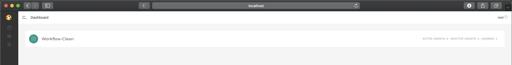
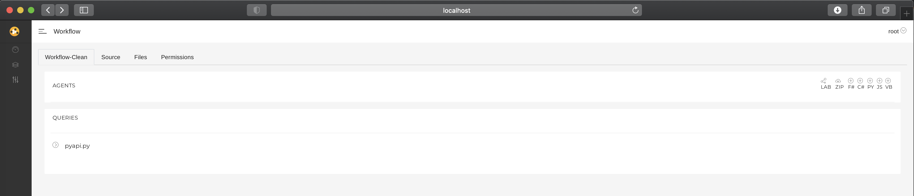
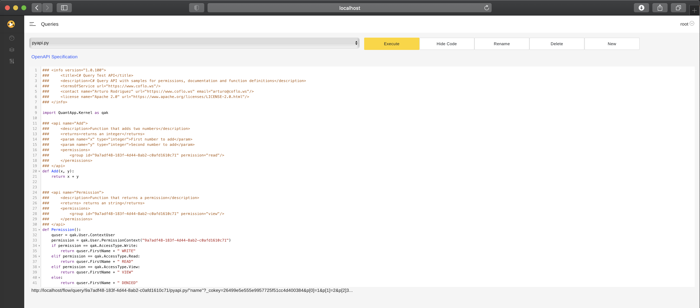
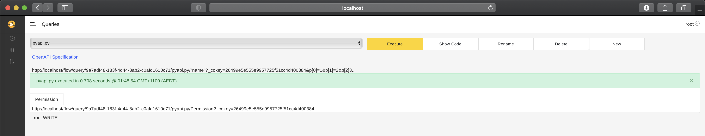
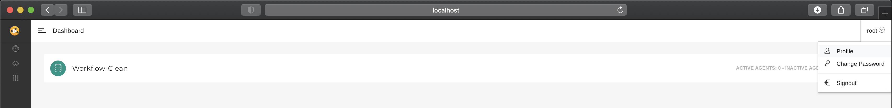
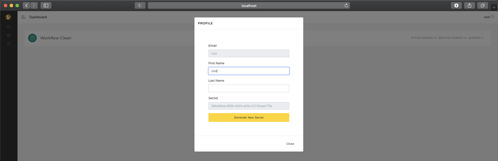

# Tutorial 1 - Simple APIs

This tutorial explains how to create a simple API with [**CoFlows CE (Community Edition)**](https://github.com/QuantApp/CoFlows-CE). To gain a general overview of the CoFlows environment, we will cover the topics of:
* Queries / APIs
* Groups and Permissions
* Secret Keys
* HTTP Requests
* Open API Schema

First you must install [docker](https://www.docker.com/get-started) with support for linux containers.

    linux/macos:    docker run -v $(pwd):/app/mnt coflows/ce add workflow {name}
    windows:        docker run -v %cd%:/app/mnt coflows/ce add workflow {name}

The resulting folder will contain the following structure:

    📦/
    ┣ 📂Files
    ┣ 📂bin
    ┣ 📂jars
    ┣ 📂nugets
    ┣ 📂pip
    ┣ 📜LICENSE
    ┣ 📜README.md
    ┣ 📜coflows_config.json
    ┣ 📜localhost.json
    ┗ 📜package.json

We will get into more details regarding all of these files and folders later but to start with lets focus on the **bin** folder. The **bin** folder contains a number of scripts that call the **CoFlows** container to execute a number of tasks including building workflows, starting the server and executing single APIs / Queries.

First, through the terminal enter into the **bin** folder if you are using linux/macos or alternatively enter the **bin/bat** folder if you are using windows.

## APIs
To add an API you must first create a new **Query** which in the context of CoFlows is a collection of APIs. Please run the following command from within the **bin** or **bin/bat** folder as mentioned above:

    linux/macos:    sh add.sh query (cs, fs, py, java, scala, js, vb) {name of query}
    windows:        add.bat query (cs, fs, py, java, scala, js, vb) {name of query}

This will create a new subfolder and a source file with two sample APIs:
* Add - This API takes two variables returns their sum
* Permission - This API returns the name of the current user and their permission to the existing group. More on groups below.

These two functions are automatically assigned web end-points (URLs) transforming them to Web APIs.

Lets run an example step by step to create a Python API:

    linux/macos:    sh add.sh query py pyapi
    windows:        add.bat query py pyapi

your folder structure should now look as follows:

    📦/
    ┣ 📂Queries
    ┃ ┗ 📜pyapi.py

The pyapi.py looks like this:

    ### <api name="Add">
    ###     <description>Function that adds two numbers</description>
    ###     <returns>returns an integer</returns>
    ###     <param name="x" type="integer">First number to add</param>
    ###     <param name="y" type="integer">Second number to add</param>
    ###     <permissions>
    ###         <group id="$WID$" permission="read"/>
    ###     </permissions>
    ### </api>
    def Add(x, y):
        return int(x) + int(y)

    ### <api name="Permission">
    ###     <description>Function that returns a permission</description>
    ###     <returns> returns an string</returns>
    ###     <permissions>
    ###         <group id="$WID$" permission="view"/>
    ###     </permissions>
    ### </api>
    def Permission():
        quser = qak.User.ContextUser
        permission = qak.User.PermissionContext("$WID$")
        if permission == qak.AccessType.Write:
            return quser.FirstName + " WRITE"
        elif permission == qak.AccessType.Read:
            return quser.FirstName + " READ"
        elif permission == qak.AccessType.View:
            return quser.FirstName + " VIEW"
        else:
            return quser.FirstName + " DENIED"

Both of these functions are assigned API end-points. In this code there is a variable $WID$ which automatically is set to the ID of the Workflow. This might be as good a time as any to mention groups and permissions in **CoFlows**. 

We can easily add a new API to this Query. Lets assume we want to add the **Print** functionality. To do this, simply add the following function to the source file:

    import json
    ### <api name="Print">
    ###     <description>Function that prints a json</description>
    ###     <returns>returns an integer</returns>
    ###     <param name="x" type="string">JSON object</param>
    ###     <permissions>
    ###         <group id="9a7adf48-183f-4d44-8ab2-c0afd1610c71" permission="read"/>
    ###     </permissions>
    ### </api>
    def Print(x):
        return json.loads(x)

Please note the name in the xml meta data 

    <api name="Print"> 

is exactly the same as the name of the function. This must be the case for the queries permissions to work.

### Permissions
Each Workflow has a unique **ID** which is visible in the **package.json** folder. The **package.json** file fully declares the Workflow and it's dependencies. Please note that the Workflows **ID** is automatically generated by **CoFlows** if the ID entry is empty in the **package.json** file. 

The **ID** also defines a group which is used to declare permissions / authorisations to the APIs. These permissions are used in two places in the example above.

First, the Permission function calls the PermissionContext library to get the permission of the user that is currently logged in to access the workflow $WID$:

    permission = qak.User.PermissionContext("$WID$")

Secondly, the permissions are used in the meta-data of both functions to define who may access these functions as APIs:

    ###     <permissions>
    ###         <group id="$WID$" permission="view"/>
    ###     </permissions>

It is possible to add multiple groups and assign different permissions to each group. User's are deemd to have access if they are part of a group and at least have the specified permission in this group.

There are four different permissions:
* Denied (-1)
* View (0)
* Read (1)
* Write (2)

The numbers linked to each permission define the permission's value and in the example above, the minimum permission a user must have in the $WID$ group is **Read**. If a user is not part of the group, the user has no access. If the user has the **View** permission, the user has no access because **View** < **Read**. If the user has the **Read** or **Write** permission, then the user has access and is allowed to call the API.

## Execute

Now that we have an understanding of these principles, lets run the code by typing:

    linux/macos:    sh server.sh
    windows:        server.bat

This will generate the following output:

    CoFlows CE - NetCoreApp 3.1... Python starting... QuantApp Server 11/01/2020 12:17:17
    DB Connected
    Local deployment
    Workflow-Clean started
    SSL encryption is not used....
    warn: Microsoft.AspNetCore.DataProtection.Repositories.FileSystemXmlRepository[60]
        Storing keys in a directory '/root/.aspnet/DataProtection-Keys' that may not be persisted outside of the container. Protected data will be unavailable when container is destroyed.
    warn: Microsoft.AspNetCore.DataProtection.KeyManagement.XmlKeyManager[35]
        No XML encryptor configured. Key {5ce74f79-603d-4145-bd52-f3f3b2489778} may be persisted to storage in unencrypted form.

In this example the $WID$ value was automatically set to 9a7adf48-183f-4d44-8ab2-c0afd1610c71 which can be seen below.

The go to the http://localhost url and you will see:

Login with 
* Username: root
* Password: 123

and you will see:

now click on the **pyapi.py** link in the page below:

to see the source code view of the query:

**Please not that changing the code in this UI WILL change the code in your local file and vice versa!**

Finally you will be able to run the query to see the values of all apis / functions that take no paramteres. In the this case it is only the **Permission** API since **Add** requires to parameters:

The end-points to these APIs are now visible and are for the **Permission** API:

http://localhost/flow/query/9a7adf48-183f-4d44-8ab2-c0afd1610c71/pyapi.py/Permission?_cokey=26499e5e555e9957725f51cc4d400384

and for the **Add** API:

http://localhost/flow/query/9a7adf48-183f-4d44-8ab2-c0afd1610c71/pyapi.py/Add?p[0]=X&p[[1]=Y&_cokey=26499e5e555e9957725f51cc4d400384
where X and Y are any numbers.

Using curl you are able to test this API

    curl "http://localhost/flow/query/9a7adf48-183f-4d44-8ab2-c0afd1610c71/pyapi.py/Add?p[0]=1&p[1]=2&_cokey=26499e5e555e9957725f51cc4d400384"

The **cokey** is a secret key used to authenticate a user without the need to login. More information about the **cokey** is available below. For the sake of security, it is preferable to include the **cokey** in the hearder instead of the URL 

    curl -H "_cokey: 30be80ea-835b-4524-a43a-21742aae77fa" "http://localhost/flow/query/9a7adf48-183f-4d44-8ab2-c0afd1610c71/pyapi.py/Add?p[0]=1&p[1]=2"

Please note that in the format of the URL is

    http://localhost/flow/query/{$WID$}/{Query}/{API}?p[0]=1&...p[n]=2&_cokey=XXX

where **p[0],...,p[n]** represent the parameters of the function / API. A more secure alternative is

    http://localhost/flow/query/{$WID$}/{Query}/{API}?p[0]=1&...p[n]=2

with the header "_cokey: XXX".

## HTTP GET and POST Requests
**CoFlows** allows both GET and POST calls to the APIs. Since the previous **Add** example was a GET call, we will now discuss the POST calls. The **Print** function we added above can be called through a POST request since it expects a more complex object. Infact, a serialized version of the JSON object is passed as a string and then deserialized by the function itself. 

All functions that are supposed to be called by POST requests should expect to receive one string variable that the function should deserialize internally by the developer. 

An example of calling the **Print** API above is:

    def Print(x):
        return json.loads(x)

where the variable **x** is expected to be a string that is deserialised by **json.loads**. The curl command to call the API is:

    curl -d '{"key":"value"}' -H "Content-Type: application/json" -X POST -g "http://localhost/flow/query/9a7adf48-183f-4d44-8ab2-c0afd1610c71/pyapi.py/Print?_cokey=30be80ea-835b-4524-a43a-21742aae77fa"

## Secret Keys
All URLs for the API end-points above have the extra parameter called **_cokey**. The **_cokey** parameter is an identification key that allows API calls without the need to go through the standard login process and aqcuire a JWT token.

The secret key is visible in the profile which you access by click in the to right corner

and then select profile:

The secret key should be kept secret as it offers access to the system through the related user. This key can also be re-generated by click on the yellow button above.

## Open API Schema
All queries in **CoFlows** can generate Open API Schemas defined by the meta tags of the APIs / functions in the query.

The url to generate this schema is:

    http://localhost/flow/openapi/{{$WID$}}/{{Query}}?_cokey=XXX

and in the example above we specifically had

    http://localhost/flow/openapi/9a7adf48-183f-4d44-8ab2-c0afd1610c71/pyapi.py?_cokey=30be80ea-835b-4524-a43a-21742aae77fa

Note that the **_cokey** can be added in the header to increase security. Here is a sample schema:

        openapi: 3.0.0
        info:
        title: Python Query Test API
        description: Python Query API with samples for permissions, documentation and function definitions
        version: 1.0.100
        termsOfService: https://www.coflo.ws
        license:
            name: Apache 2.0
            url: https://www.apache.org/licenses/LICENSE-2.0.html
        contact:
            name: Arturo Rodriguez
            url: https://www.coflo.ws
            email: arturo@coflo.ws
        servers:
        - url: http://localhost/flow/query/9a7adf48-183f-4d44-8ab2-c0afd1610c71/pyapi.py
        paths:
        /Add:
            get:
            description: Function that adds two numbers
            parameters:
            - name: x
                in: query
                required: true
                description: First number to add
                schema:
                type: integer
            - name: y
                in: query
                required: true
                description: Second number to add
                schema:
                type: integer
            - name: _cokey
                in: query
                required: false
                description: CoFlows User Key. This value can also be set in the Header
                schema:
                type: string
            responses:
                200:
                description: returns an integer
        /Permission:
            get:
            description: Function that returns a permission
            parameters:
            - name: _cokey
                in: query
                required: false
                description: CoFlows User Key. This value can also be set in the Header
                schema:
                type: string
            responses:
                200:
                description: ' returns an string'

## Build
Although you can add new queries to the Workflow through the CLI commands above, you can also add source files to the Queries folders. If you do so, you must build the project in order for the configuration files to be correcly updated and take into account the new files.

Build the workflow

    linux/macos:    sh build.sh local
    windows:        build.bat local

This steps populates the Base, Agents and Queries sections of the **package.json** file. It also pulls all dependencies declared in the nuget, jars and pip sections of the **package.json** entries. Note that F# requires Base files to be ordered according to their dependencies. If a F# base file depends on another F# file, please make sure that the files are ordered accordingly.

## Notes:
* If ID in package is empty then build.sh will auto generate an ID
* build.sh will add new entries to the Files, Queries, Agents and Base sections of the package.json. It will not delete entries, this needs to be done manually.
* $WID$ is code to populate the Workflow ID in queries and agents. NOTE: Files will be overwritten once with the replacements.

## Next Tutorial
Please continue on to the [Second Tutorial](tutorial-2.md) to learn about linking third party dependencies like **[pips](https://pypi.org/project/pip/), [nugets](https://www.nuget.org) or [jars](https://maven.apache.org)** with [**CoFlows CE (Community Edition)**](https://github.com/QuantApp/CoFlows-CE). 

  