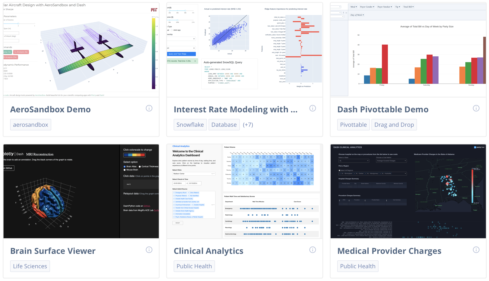
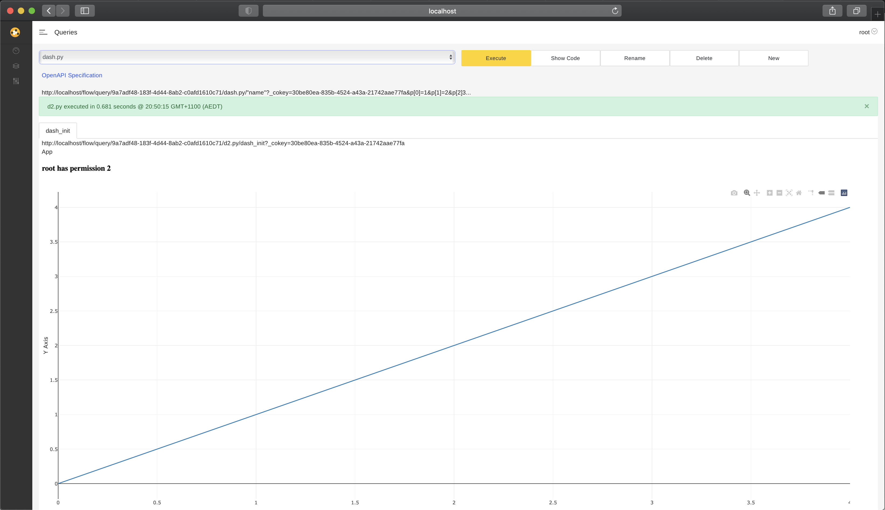
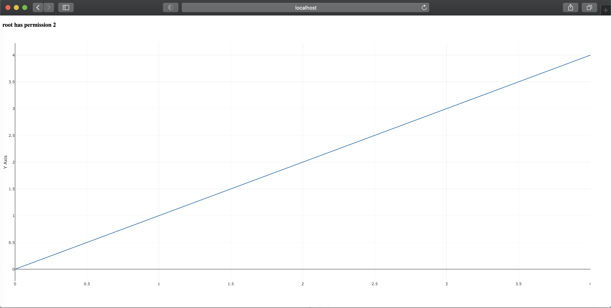
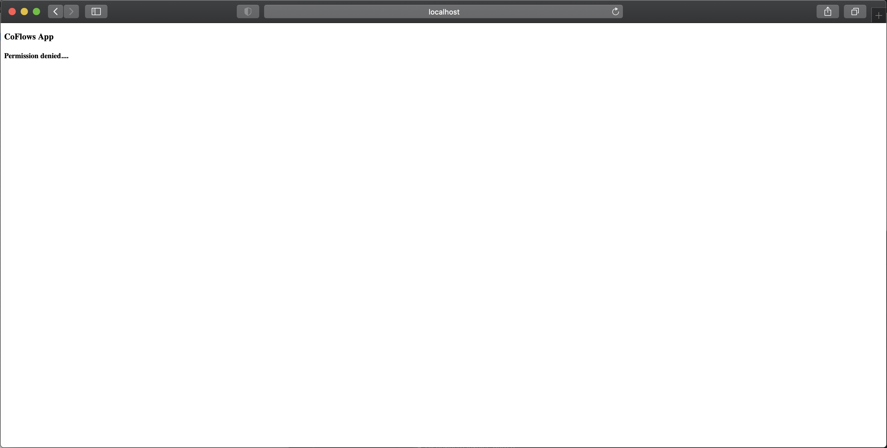

# Tutorial 4 - Apps with Plotly Dash

This tutorial builds on the [first tutorial](tutorial-1.md) and explains how to build beautiful Apps with the power of [Plotly Dash](https://plotly.com/dash/) in with [**CoFlows CE (Community Edition)**](https://github.com/QuantApp/CoFlows-CE). 

Through the terminal, enter into the **bin** folder if you are using linux/macos or alternatively enter the **bin/bat** folder if you are using windows.

## Plotly Dash

According to Plotly's website: Dash is the most downloaded, trusted framework for building ML & data science web apps. It empowers teams to build data science and ML apps that put the power of Python, R, and Julia in the hands of business users. Full-stack apps that would typically require a front end, back end, and DevOps team can now be built and deployed in hours by data scientists with Dash.

**CoFlows** implements the open-source python version of this wonderful framework. Dash apps require some boiler plate code in order to do the magic of integrating them into our container and make it easy for users to run. The template app that is added below has all the relevant structures and is documented in order to help you customise it.

Although the template we have added is not particularly pretty it is minimal in order to simplify the work for developers. For you to get a better view of what can be created with Plotly please see this screenshot from their webpage:

## Create an App

To add an app please run the following command from the within the **bin** or **bin/bat** folder as mentioned above:

    linux/macos:    sh add.sh dash {name of app}
    windows:        add.bat dash {name of app}

This will create a new subfolder and a source file with the template.
Lets run an example step by step to create a Python API assuming we are using a macos based machine.

    sh add.sh dash app

your folder structure should now look as follows:

    📦/
    ┣ 📂Queries
    ┃ ┗ 📜app.py

The code is relatively long so its not worth posting here. I will discuss certain parts of the structure and how it works. There are certain parts of the code that must be left intact and we have tried to highlight where you can and cannot edit.

There are two main sections to a Dash app, first is the layout which defines how the app looks and second is the callbacks that define how what the app does. We have added certain structures to the layout in order to capture information from the URL. One of the URL parameters is the User Secret used to identify who is accessing the App and access permissions. Developers are also able to add more parameters to the URL and capture them using this functionality for custom needs.

    # ALL DASH CODE MUST START HERE
    # USER: Start Layout Define
    app.layout = html.Div(
                children=[
                    # Leave this section here. It used to access the
                    # URL and store the sessions permission and secret information
                    # Start -----
                    dcc.Location(id='url', refresh=False),
                    html.Div(
                        children= [
                            html.Div(id='link_id', children=[]),
                            html.Div(id='perm_id', style=dict(display='none')),
                            html.Div(id='secret', style=dict(display='none')),
                        ],
                    ),
                    # Finish -----

                    # Main layout section. Please edit this here to customise
                    ...
                    Please add your layout code here
                    ...

                    # Layout that is shown while the app is loading
                    html.Div(
                        id='loading_id',
                        style=dict(display='none'),
                        className='row',
                        children=[
                            html.Div(
                                children= [
                                    html.H3(children='CoFlows App'),
                                    html.H4(children='Loading....'),
                                ]
                            )
                        ]
                    ),

                    # Layout that is shown when access to the group is denied
                    html.Div(
                        id='denied_id',
                        style=dict(display='none'),
                        className='row',
                        children=[
                            html.Div(
                                children= [
                                    html.H3(children='CoFlows App'),
                                    html.H4(children='Permission denied....'),
                                ]
                            )
                        ]
                    )
    ...
    # Sets related permission, user secret and check permissions from URL
    @app.callback(
        [
            Output('perm_id', 'children'),
            Output('secret', 'children'),
            Output('main_id', 'style'),
            Output('denied_id', 'style'),
            Output('loading_id', 'style'),
        ],
        [
            Input('url','search')
        ])
    def set_start_values(args):
        args = getArgs(args)
        if args is not None:
            uid = args['uid']

            cuser = qak.User.ContextUserBySecret(uid)
            qgroup = qak.Group.FindGroup('$WID$')
            perm = qgroup.PermissionSecret(uid)
            
            if perm > -1:
                return [perm, uid, dict(), dict(display='none'), dict(display='none')]
            elif perm == -1:
                return [perm, uid, dict(display='none'), dict(), dict(display='none')]
            else:
                return [perm, uid, dict(display='none'), dict(display='none'), dict()]
            
        return [-1, '', dict(display='none'), dict(), dict(display='none')]

    #callbacks ...
    ...
    Here is where you add further callbacks to manage you custom needs
    ...
    # ALL DASH CODE MUST END HERE

Note: Please see [tutorial 5](tutorial-5.md) for more details on the permissions functionality called above.

When adding the template as done in the example above you can open the app script through the Query UI and executing it. You should see the following:

Alternatively, you can go to the following URL from your browser to see a clean view that can even be injected into an iframe:

    http://localhost/dash/9a7adf48-183f-4d44-8ab2-c0afd1610c71/app.py?uid={User Secret}

the general URL is

    http://localhost/dash/{$WID$}/{app name}.py?uid={User Secret}

and you should see:

The template contains certain logic that manages permissions. If the user does not have access to the Workflow group, the following view appears:

## Next Tutorial
Please continue on to the [Fifth Tutorial](tutorial-5.md) to learn about user management and permissions with [**CoFlows CE (Community Edition)**](https://github.com/QuantApp/CoFlows-CE). 

  

