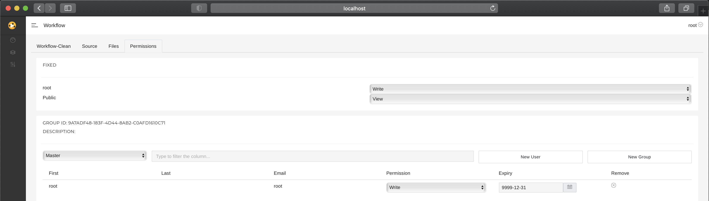
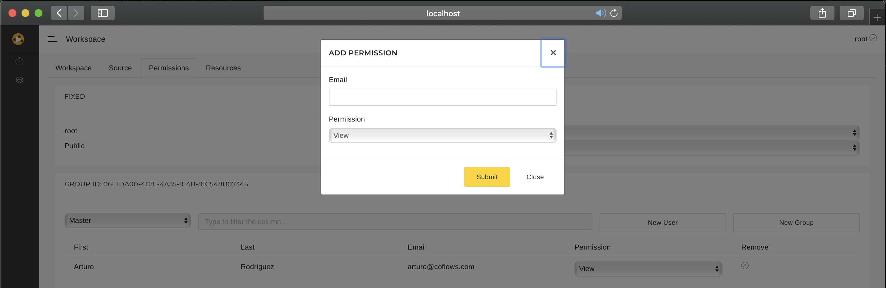
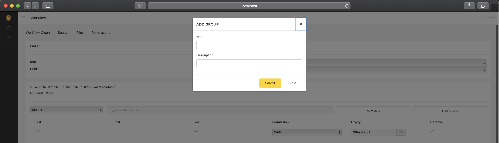
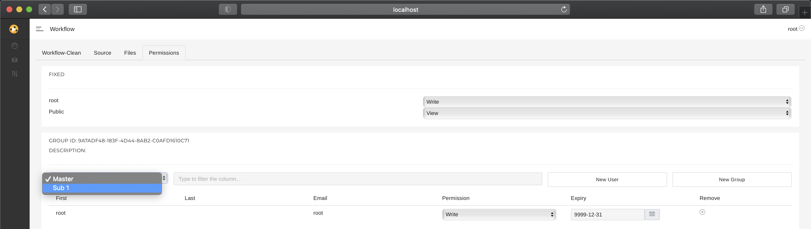

# Tutorial 5 - Users, Groups, Permissions and Expiries

This tutorial builds on the [first tutorial](tutorial-1.md) and explains how users are managed together with their permissions / expiries and the concept of groups in [**CoFlows CE (Community Edition)**](https://github.com/QuantApp/CoFlows-CE). 

A user's permission is modelled through the user's membership to groups. A user's membership is defined by two factors, the access type and the access expiry. The access expiry allows permissions to have a timeline for how long a user is allowed to have access to the group.

To create / manage groups and their memberships you can use the **CoFlows** UI. **CoFlows** has Web APIs to manage these groups and memberships but this functionality sits outside of the scope of this tutorial.

In order to link these permissions to a developers APIs and custom functionality, **CoFlows** has a simple API and meta-data functionality for the Queries / APIs.

**Please note that every Workflow is linked to a Group through the ID. A Workflow's ID will always have a respective Group with the same ID.**

## APIs and Groups
Lets discuss the example from the first tutorial

    ### <api name="Permission">
    ###     <description>Function that returns a permission</description>
    ###     <returns> returns an string</returns>
    ###     <permissions>
    ###         <group id="$WID$" permission="view"/>
    ###     </permissions>
    ### </api>
    def Permission():
        quser = qak.User.ContextUser
        permission = qak.User.PermissionContext("$WID$")
        if permission == qak.AccessType.Write:
            return quser.FirstName + " WRITE"
        elif permission == qak.AccessType.Read:
            return quser.FirstName + " READ"
        elif permission == qak.AccessType.View:
            return quser.FirstName + " VIEW"
        else:
            return quser.FirstName + " DENIED"

This function contains the two main ways of using **CoFlows'** permissions functionality. First off, lets look at the xml formatted meta data of the function

    ###     <permissions>
    ###         <group id="$WID$" permission="view"/>
    ###     </permissions>

A developer can use this to add all the groups that a user must be a member of and the minimum permission required. As mentioned in the [first tutorial](tutorial-1.md), there are four different permissions:
* Denied (-1)
* View (0)
* Read (1)
* Write (2)

Below is an example of this meta data that allows access to members of multiple groups:

    ###     <permissions>
    ###         <group id="Group-1" permission="view"/>
    ###         <group id="Group-2" permission="read"/>
    ###     </permissions>

This example requires users to either be a member of "Group-1" with a minimum permission of **View** or be a member of "Group-2" with a minimum of permission **Read***.

The numbers linked to each permission define the permission's value and in the example above, the minimum permission a user must have in the $Group-2$ group is **Read**. If a user is not part of the group, the user has no access. If the user has the **View** permission, the user has no access because **View** < **Read**. If the user has the **Read** or **Write** permission, then the user has access and is allowed to call the API.

### Permissions
Each Workflow has a unique **ID** which is visible in the **package.json** folder. The **package.json** file fully declares the Workflow and it's dependencies. Please note that the Workflows **ID** is automatically generated by **CoFlows** if the ID entry is empty in the **package.json** file. 

The **ID** also defines a group which is used to declare permissions / authorisations to the APIs. These permissions are used in two places in the example above.

First, the Permission function calls the PermissionContext library to get the permission of the user that is currently logged in:

    permission = qak.User.PermissionContext("$WID$")

Secondly, the permissions are used in the meta-data of both functions to define who may access these functions as APIs:

    ###     <permissions>
    ###         <group id="$WID$" permission="view"/>
    ###     </permissions>

It is possible to create multiple groups and assign different permissions to each group. User's are deemd to have access if they are part of a group and at least have the specified permission in this group.

There are four different permission levels:
* Denied (-1)
* View (0)
* Read (1)
* Write (2)

The numbers linked to each permission define the permission's value. In the example above, the minimum permission a user must have in the $WID$ group is **Read**. If a user is not part of the group, the user has no access. If the user has the **View** permission, the user has no access because **View** < **Read**. If the user has the **Read** or **Write** permission, then the user has access and is allowed to call the API.

## User Interface

Below are the steps to manage users and their permissions through the UI:

1) View the permissions for this Workflow. Fixed permissions are readonly and cannot be changed in the UI. The Group permissions are managed in the block below.

2) To add a user to a Group you need to specify their email. The user must have an account on this container with the same email you specify.

3) Groups can be added easily too.

4) Changing which group you want to manage can be done through select box like so. The Master group is the group for the entire Workflow. All users in the Workflow must be added to this group. Users can only be added to the "sub" groups once they are part of the master group.

## Next Tutorial
Please continue on to the [Sixth Tutorial](tutorial-6.md) to learn about linking configuring the environment and get it ready to host workflows. 
