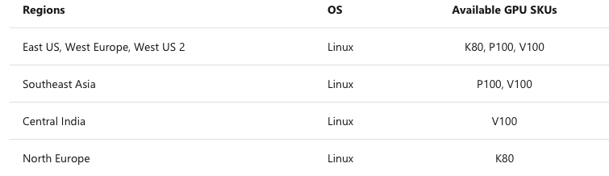
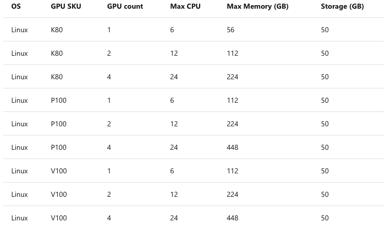

# Tutorial 6 - Configurations, Hosting and Deployment

This tutorial builds on the [second tutorial](tutorial-1.md) and explains how to create an API that depends on libraries like **[pips](https://pypi.org/project/pip/), [nugets](https://www.nuget.org) or [jars](https://maven.apache.org)** with [**CoFlows CE (Community Edition)**](https://github.com/QuantApp/CoFlows-CE). 

In **CoFlows** a project is called a Workflow. Developers declare the entire environment through two files called **package.json** and **coflows_config.json** where they define both the project and it's executing containers together with the required resources.

The logic in Workflows is assigned to three different types.
* Base which are general libraries called through out the system
* [Agents](Files/docs/Agents/General.md "Agents") which are designed to react to either changes to an [M](../M.md "M Set") topic, or to scheduled events according to developer defined **cron jobs** within **CoFlows**.
* [Queries](Files/docs/Queries/General.md "Queries") where developers can define Web API entry points to the Workflows through Queries. Every function defined in a query is automatically assigned a _url_ by the **CoFlows** simplifying the process of creating these endpoints.

Every workspace depends on a set of sections (this is all reflected in the **package.json** file):
* **Base** code containing libraries used across the entire project
* [Agents](Files/docs/Agents/General.md "Agents") code describing functions that are called either on a scheduled basis or that react to various external triggers. Agents can pull data from a website or check for updates in a database to give a few examples
* [Queries](Files/docs/Queries/General.md "Queries") code defining functions that are automatically assigned URLs for WebAPI access from external systems.
* **Resources** settings to specify CPU / Memory requests and limits in a Kubernetes format.
* **Pips** Pip dependencies of your python code
* **NuGets** NuGet dependencies of your C#, F# and VB code
* **Jars** Jar dependencies of you Java and Scala code that are remotely hosted and referenced in a URL format.
* **Bins** Dlls or Jar files needed by your project that you provide. These are usually used for custom Dlls or Jars that are not in Maven or NuGet. 
* **Files** Generic files relevant for to the project. **Jupyter** Notebooks are a good example.

## Configure  
The file called _coflows_config.json_ defined the runtime environment in **CoFlows**.

    coflows_config.json
    {
        "Database": { 
            "Connection": "mnt/database.db" ,
            "Type": "sqlite" // **sqlite** for a SQLite db and **mssql** for a MS SQL Server
        },
        "Workflow": "mnt/package.json",
        "Jupyter": false,
        "Server":{
            "Host": "localhost", //Set the host name
            "SecretKey": "26499e5e555e9957725f51cc4d400384", //User key used for Jypter Labs - No need to change
            "LetsEncrypt":{
                "Email": "",
                "Staging": false
            }
        },
        "Cloud":{
            "Host": "coflows.quant.app", //Set the cloud host name
            "SecretKey": "xxx", //Set your cloud secret key (login to CoFlows Cloud, then at the top right click on your name, profile and your secret key will appear)
            "SSL": true
        }
        "AzureContainerInstance": {
            "AuthFile":"mnt/Files/my.azureauth",
            "Dns": "coflows-container",
            "Region": "UKSouth",
            "Cores": 4,
            "Mem": 4,
            "Gpu": {
                "SKU": "", // Empty = no GPU or K80, P100, V100
                "Cores": 1 // 1, 2 or 4 
            }
        }
    }

We will now go through all the different sections of this file.

### Database

Store user, group permissions and M Set in to the local file system using a SQLite database. Please note that if you are deploying **CoFlows** to an Azure Container Instance, this file will be deleted on each restart so please use the MS SQL Server alternative below.

        "Database": { 
            "Connection": "mnt/database.db" ,
            "Type": "sqlite"
        },
For more scalable persistence, a MS SQL Server connection is available. Below is an example of a connection to an Azure SQL Server.

        "Database": { 
            "Connection": "Server={{SERVER_NAME}}.database.windows.net,1433;Database={{DATABASE_NAME}};User ID={{USERNAME}};Password={{PASSWORD}};MultipleActiveResultSets=True;Packet Size=32768" ,
            "Type": "mssql"
        },

### Workflow
All workspaces are defined by a json file that specifies all of the source code and dependencies of the project.

### Jupyter
**CoFlows** allows you to run a Jupyter Lab instances within the container. This allows you to both create notebooks and access the internal terminal. If this value is "true" then the Lab is started otherwise not.

### Server
This section defines the behavior of the runtime server. _Host_ specifies the name of the host container. In this example the container runs as a localhost. 

The SecreKey is used by Jupyter Labs so this key should be changed. More to come about this soon.

When facing the public internet, SSL is a necessity. We use LetsEncrypt to automatically and freely issue SSL Certificates. This is configured by setting an email and defining a host name different to "localhost". If either the host is localhost or the email is an empty string then the SSL certificate will not be issued and the host will only be accessible through "http". The example below shows a version where LetsEncrypt is active.

The staging flag in the LetsEncrypt block follows the standard LetsEncrypt functionality. If the setting is false, an actual SSL certificate is issued, otherwise a dummy certificate is created. Please read the LetsEncrypt documentation [here](https://letsencrypt.org/docs/).

        "Server":{
            "Host": "localhost", //Set the host name
            "SecretKey": "26499e5e555e9957725f51cc4d400384", //User key used for Jypter Labs - No need to change
            "LetsEncrypt":{
                "Email": "",
                "Staging": false
            }
        },

Below is an example of a **CoFlows** container facing the internet with SSL. This server is only accessible through "https://app.coflows.com". Please note that the app.coflows.com domain must point to the IP address of this container. To achieve this you must own the domain and configure its DNS.

        "Server":{
            "Host": "app.coflows.com", //Set the host name
            "SecretKey": "26499e5e555e9957725f51cc4d400384", //User key used for Jypter Labs - No need to change
            "LetsEncrypt":{
                "Email": "john@doe.com",
                "Staging": false
            }
        },

### Cloud
**CoFlows** is a distributed system that allows users to execute commands through a CLI (terminal) on a local computer that run code on a hosted container. For example, if you host a workspace on an Azure Container Instance, you can execute code on that container through the CLI on your localhost. More examples of this below. 

        "Cloud":{
            "Host": "app.coflows.com", //Set the cloud host name
            "SecretKey": "xxx", //Set your cloud secret key (login to CoFlows Cloud, then at the top right click on your name, profile and your secret key will appear)
            "SSL": true
        }

### Azure Container Instance
Deploying a **CoFlows** workspace to an azure container instance is very easy. The overall declaration for this process is defined below:

        "AzureContainerInstance": {
            "AuthFile":"mnt/Files/my.azureauth",
            "Dns": "coflows-container",
            "Region": "UKSouth",
            "Cores": 4,
            "Mem": 4,
            "Gpu": {
                "SKU": "", // Empty = no GPU or K80, P100, V100
                "Cores": 1 // 1, 2 or 4 
            }
        }

### AuthFile
First you must create a file, in the example below its called _my.azureauth_ with credentials to access your Azure subscription. To get this you must login to the [Azure Portal]("https://portal.azure.com"), open the terminal in bash and type

    az ad sp create-for-rbac --sdk-auth > my.azureauth

then open the _my.azureauth_ file and copy it's contents to a local file which you store under "mnt/Files/my.azureauth" as per the example below. This repo has a dummy file in this location for the sake of clarity.

### Dns
Is the name of the azure container instance. If you type "coflows-container" the URL to access this container will be something like "https://coflows-container.uksouth.azurecontainer.io". Please note the Region becomes part of the URL. This URL is important when redirecting your domain dns if you are using SSL encryption.

### Region
Azure has many regions world wide to choose from when hosting your container. Different regions will have different resources available and as of the publication of this text, not all regions have Azure Container Instances available. Please check the azure webpage to verify this.

The code that should be set in this place is the Name of the region as per the table below. For example, UK South is called uksouth. To generate this table and have an up to date version please login to the [Azure Portal]("https://portal.azure.com"), open the terminal (bash) and type:

    az account list-locations -o table

        DisplayName           Latitude    Longitude    Name
        --------------------  ----------  -----------  ------------------
        East Asia             22.267      114.188      eastasia
        Southeast Asia        1.283       103.833      southeastasia
        Central US            41.5908     -93.6208     centralus
        East US               37.3719     -79.8164     eastus
        East US 2             36.6681     -78.3889     eastus2
        West US               37.783      -122.417     westus
        North Central US      41.8819     -87.6278     northcentralus
        South Central US      29.4167     -98.5        southcentralus
        North Europe          53.3478     -6.2597      northeurope
        West Europe           52.3667     4.9          westeurope
        Japan West            34.6939     135.5022     japanwest
        Japan East            35.68       139.77       japaneast
        Brazil South          -23.55      -46.633      brazilsouth
        Australia East        -33.86      151.2094     australiaeast
        Australia Southeast   -37.8136    144.9631     australiasoutheast
        South India           12.9822     80.1636      southindia
        Central India         18.5822     73.9197      centralindia
        West India            19.088      72.868       westindia
        Canada Central        43.653      -79.383      canadacentral
        Canada East           46.817      -71.217      canadaeast
        UK South              50.941      -0.799       uksouth
        UK West               53.427      -3.084       ukwest
        West Central US       40.890      -110.234     westcentralus
        West US 2             47.233      -119.852     westus2
        Korea Central         37.5665     126.9780     koreacentral
        Korea South           35.1796     129.0756     koreasouth
        France Central        46.3772     2.3730       francecentral
        France South          43.8345     2.1972       francesouth
        Australia Central     -35.3075    149.1244     australiacentral
        Australia Central 2   -35.3075    149.1244     australiacentral2
        UAE Central           24.466667   54.366669    uaecentral
        UAE North             25.266666   55.316666    uaenorth
        South Africa North    -25.731340  28.218370    southafricanorth
        South Africa West     -34.075691  18.843266    southafricawest
        Switzerland North     47.451542   8.564572     switzerlandnorth
        Switzerland West      46.204391   6.143158     switzerlandwest
        Germany North         53.073635   8.806422     germanynorth
        Germany West Central  50.110924   8.682127     germanywestcentral
        Norway West           58.969975   5.733107     norwaywest
        Norway East           59.913868   10.752245    norwayeast

### GPU
Azure also allows you to deploy **CoFlows** Workflows to GPU enabled containers. Here you must specify the SKU and the number of cores.

There are certain limitations currently regarding regions and availability as previously stated to please mind the following table:

and also consider certain core vs gpu count constraints according to:

For more up to date information please visit [Azure GPUs]("https://docs.microsoft.com/en-us/azure/container-instances/container-instances-gpu").

## Running Locally and the CoFlows CLI (Command Line Interface)
We have designed a CLI in order to interact with **CoFlows** through the terminal. This CLI offers almost full control over the commands within **CoFlows** to a developer to:
* Test code
* Run a local version of the container / server
* Deploy containers to Azure Container Instances
* Query code on a remote **CoFlows** container.

### Running
First, to run the a local version of the server you can execute the following scripts
        unix: bin/server.sh
        win: bin/bat/server.bat

In some instances you may want to create a custom version of the coflows_config.json setup. For example you may want to test connections of the same code to various databases. To this end you can type: 
        unix: bin/server.sh custom_coflows_config.json
        win: bin/bat/server.bat custom_coflows_config.json

### Building
Workflow can be built (compiled and referenced) either locally or on a remote server. The remote server is defined in the *Cloud* entry in the *coflows_config.json* file. A local build, as the name specifies means that the workspace is built locally on your machine. In contrast, a cloud build means the Workflow source code is sent to the cloud server, and the cloud server builds the code remotely.

        Local:
            unix: bin/build.sh local
            win:  bin/bat/build.bat local

        Cloud:
            unix: bin/build.sh cloud
            win:  bin/bat/build.bat cloud

### Executing Queries
Developers can execute queries without the need to either start a local server or redeploy a remote server. This possibility is a quick option while developing code.

        Local:
            unix: bin/query.sh local query_id function_name  parameters[0] ... parameters[n]
            win:  bin/bat/query.bat local query_id function_name  parameters[0] ... parameters[n]

        Cloud:
            unix: bin/query.sh cloud query_id function_name  parameters[0] ... parameters[n]
            win:  bin/bat/query.bat cloud query_id function_name  parameters[0] ... parameters[n]

If you want to use a custom setup defined by another version of the coflows_config.json you can do the following:

        unix: bin/query_customg.sh {custom_coflows_config.json} local query_id function_name  parameters[0] ... parameters[n]
        win:  bin/bat/query_custom.bat {custom_coflows_config.json} local query_id function_name  parameters[0] ... parameters[n]

Deploying to an Azure Container Instances is achieved through (after you have created the auth config file):

        Deploy to an Azure Container Instance
            unix: bin/azure_deploy.sh local
            win:  bin/bat/azure_deploy.bat local

        Remove an Azure Container Instance
            unix: bin/azure_remove.sh
            win:  bin/bat/azure_remove.bat